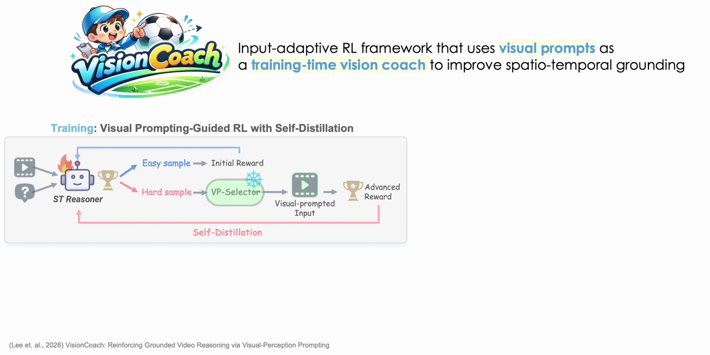

<div align="center">

# VisionCoach: Reinforcing Grounded Video Reasoning via Visual-Perception Prompting


[](https://arxiv.org/abs/2512.01707)
[](https://visioncoach.github.io/)
[](https://huggingface.co/danaleee/VisionCoach-7B)

<div>
    <a href="https://daeunni.github.io/" target="_blank">Daeun Lee</a>,
    <a href="https://yui010206.github.io/" target="_blank">Shoubin Yu</a>,
    <a href="https://zhangyuejoslin.github.io/" target="_blank">Yue Zhang</a>,
    <a href="https://www.cs.unc.edu/~mbansal/" target="_blank">Mohit Bansal</a>
</div>

<div>
    UNC Chapel Hill
</div>

</div>

---

## 📺 Method Overview



## 📄 Abstract

Video reasoning requires models to locate and track question-relevant evidence across frames. While reinforcement learning (RL) with verifiable rewards improves accuracy, it still struggles to achieve reliable spatio-temporal grounding during the reasoning process. Moreover, improving grounding typically relies on scaled training data or inference-time perception tools, which increases annotation cost or computational cost. To address this challenge, we propose VisionCoach, an input-adaptive RL framework that improves spatio-temporal grounding through visual prompting as training-time guidance. During RL training, visual prompts are selectively applied to challenging inputs to amplify question-relevant evidence and suppress distractors. The model then internalizes these improvements through self-distillation, enabling grounded reasoning directly on raw videos without visual prompting at inference. VisionCoach consists of two components: (1) Visual Prompt Selector, which predicts appropriate prompt types conditioned on the video and question, and (2) Spatio-Temporal Reasoner, optimized with RL under visual prompt guidance and object-aware grounding rewards that enforce object identity consistency and multi-region bounding-box IoU. Extensive experiments demonstrate that VisionCoach achieves state-of-the-art performance across diverse video reasoning, video understanding, and temporal grounding benchmarks (V-STAR, VideoMME, World-Sense, VideoMMMU, PerceptionTest, and Charades-STA), while maintaining a single efficient inference pathway without external tools.

---
## 🔧 Environment Setup

Run the following script to set up the environment:

```bash
bash ./setup.sh
```

---

## 📁 Dataset

We use the same dataset as [Open-o3-Video](https://github.com/marinero4972/Open-o3-Video). The data structure is organized as follows:

```
data/videos/
├── stgr/                    # STGR (Spatio-Temporal Grounded Reasoning)
│   ├── plm/                 # PLM subset
│   │   ├── kfs/             # Keyframes
│   │   └── videos/          # Video files
│   └── temporal_grounding/  # Temporal grounding subset
│       ├── kfs/
│       └── videos/
├── tvg_r1/                  # TVG-R1
│   └── videomind_data/
├── videor1/                 # Video-R1
├── videoespresso/           # VideoEspresso
├── treevgr/                 # TreeVGR
├── gqa/                     # GQA 
└── timerft/                 # TimeRFT 
```

---

## 🚀 Training

**Cold start initialization:**
```bash
bash ./src/scripts/run_sft_video.sh
```

**Reinforcement learning with GRPO:**
```bash
bash ./src/scripts/run_grpo_video.sh
```

---

## 📊 Evaluation

We provide benchmark evaluation including V-STAR, VideoMME, VideoMMMU, World-Sense, and PerceptionTest.

```bash
cd eval
bash ./scripts/eval_all.sh
```

---

## ✅ TODOs

- [ ] VP-Selector training code
- [ ] Visual prompting generation code

---

## 📝 Citation

If you use our work or our implementation in this repo, or find them helpful, please consider citing:

```bibtex
@article{lee2025visioncoach,
  title={VisionCoach: Reinforcing Grounded Video Reasoning via Visual-Perception Prompting},
  author={Lee, Daeun and Yu, Shoubin and Zhang, Yue and Bansal, Mohit},
  journal={arXiv preprint arXiv:2512.01707},
  year={2025}
}
```

---

## 🙏 Acknowledgements

We sincerely thank the following projects for their contributions to this work:

- [Open-o3-Video](https://github.com/marinero4972/Open-o3-Video)
- [Video-R1](https://github.com/tulerfeng/Video-R1)
- [R1-V](https://github.com/StarsfieldAI/R1-V)
- [ObjectMLLM](https://github.com/brown-palm/ObjectMLLM)
